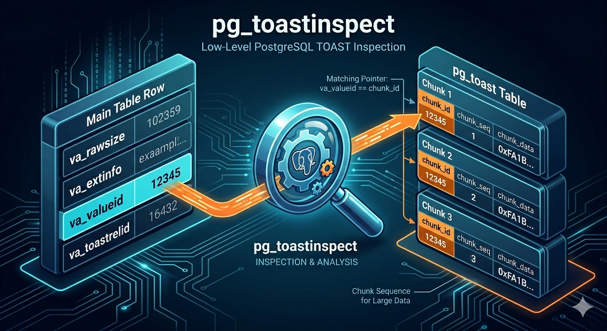

# pg_toastinspect

A PostgreSQL extension for inspecting TOAST (The Oversized-Attribute Storage Technique) information at a low level.



## Overview

pg_toastinspect provides functions to access TOAST metadata for large values stored in PostgreSQL. It allows you to retrieve chunk IDs and detailed TOAST pointer information without having to examine the internal data structures directly.

## Installation

### Prerequisites
- PostgreSQL 9.6 or later
- PostgreSQL development files (pg_config)

### Build and Install

```shell
make
make install
```

### Enable in PostgreSQL

```sql
CREATE EXTENSION pg_toastinspect;
```

## Usage

### Functions

The extension provides two main functions, overloaded for `text`, `bytea`, and `jsonb` types:

1. **`get_toast_chunk_id(val)`** - Returns the chunk ID (OID) of a TOASTed value, or NULL if the value is not TOASTed.

2. **`get_toast_info(val)`** - Returns complete TOAST pointer information as a composite type `toast_pointer_info` with these fields:
   - `raw_size` - Original uncompressed size of the value
   - `ext_size` - Size after TOAST storage (possibly compressed)
   - `chunk_id` - Chunk identifier (OID)
   - `reltoastrelid` - OID of the TOAST table

### Examples

```sql
-- Get the chunk ID of a TOASTed value
SELECT ctid, id, get_toast_chunk_id(response_content), response_content
FROM ai_call_log_copy1
WHERE id = 668310181431480320;

-- Get complete TOAST information
SELECT ctid, id, get_toast_info(response_content), response_content
FROM ai_call_log_copy1
WHERE id = 668310181431480320;

-- Access individual fields from the composite type
SELECT
    ctid,
    id,
    (get_toast_info(response_content)).raw_size,
    (get_toast_info(response_content)).ext_size,
    (get_toast_info(response_content)).chunk_id,
    (get_toast_info(response_content)).reltoastrelid
FROM ai_call_log_copy1
WHERE id = 668310181431480320;
```

## License

[PostgreSQL License](./LICENSE)


